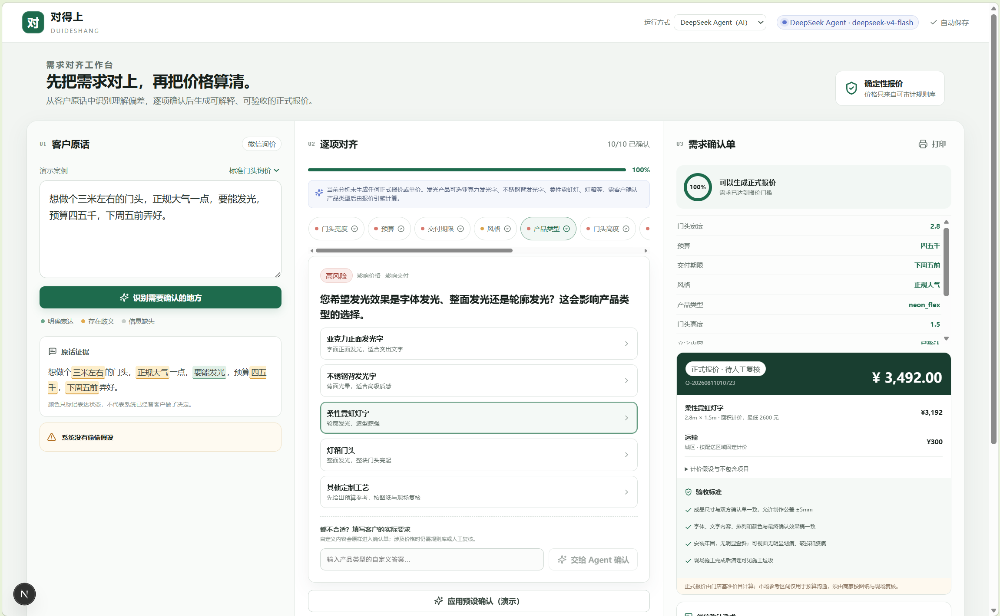

# 对得上 DuiDeShang

面向广告制作门店的需求澄清、方案确认与可解释报价助手。产品把客户的模糊口语转化为逐项确认的规格、确定性报价、交付边界和验收标准，重点解决“双方默认理解不同”导致的返工。

> 当前价格仅用于产品演示，真实项目需由商家维护价目并人工确认。

## 已实现

- 客户原话分析：明确、模糊、缺失和不支持的假设；澄清问题引用原话。
- 字体与发光结构的可理解视觉选项，逐项确认和实时确认单。
- 高风险字段未确认时，前后端双重锁定正式报价。
- YAML 规则库驱动的面积、最低价、拆除、运输、高空、加急、税费和人工调整计算。
- 报价依据、假设、不包含项目、验收标准、微信确认话术和浏览器打印。
- 字段修改留痕、localStorage 会话保存、6 个预设演示案例。
- 双 Provider：配置后使用 DeepSeek 有界 Agent；无 Key、超时或输出校验失败时自动降级到本地演示。
- Agent 可自主查询产品、材料、歧义和澄清规则工具；正式报价仍只能调用确定性程序。
- 自定义回答会进入多轮 Agent 判断，由 Agent 决定信息是否足够确认。

## 架构

```text
apps/web  Next.js App Router + TypeScript + shadcn/ui 风格组件
   │ REST /api/analyze, /api/quote
apps/api  FastAPI + Pydantic + 确定性报价引擎
   │
apps/api/knowledge 可读、可审计的 YAML 行业规则与演示内部价目
```

详细设计见 [docs/architecture.md](docs/architecture.md)。

## 本地启动

要求 Node.js 20+、npm 10+、Python 3.11+。

后端（PowerShell）：

```powershell
cd apps/api
python -m venv .venv
.\.venv\Scripts\Activate.ps1
pip install -r requirements.txt
uvicorn app.main:app --reload --port 8000
```

新开一个终端启动前端：

```powershell
cd apps/web
npm install
Copy-Item .env.example .env.local
npm run dev
```

打开 <http://localhost:3000>。默认案例可直接点击“识别需要确认的地方”，再逐项选择；面试快速演示可点“应用预设确认（演示）”。

## 启用 DeepSeek Agent

API Key 只能配置在后端，不能写入前端的 `NEXT_PUBLIC_*` 变量。在 `apps/api` 中复制配置：

```powershell
Copy-Item .env.example .env
```

然后编辑 `apps/api/.env`：

```env
MODEL_PROVIDER=deepseek
DEEPSEEK_API_KEY=replace-with-your-deepseek-api-key
DEEPSEEK_BASE_URL=https://api.deepseek.com
DEEPSEEK_MODEL=deepseek-v4-flash
DEEPSEEK_THINKING=disabled
```

重启 FastAPI。页面右上角显示“DeepSeek Agent”表示真实 Agent 已启用；显示“本地演示模式”或降级提示时，没有发生外部模型调用。Key 只由 FastAPI 读取，不会返回给浏览器或保存在 localStorage。

macOS/Linux 对应激活命令为 `source .venv/bin/activate`，复制环境变量文件用 `cp ../../.env.example .env.local`。

## 验证

```powershell
cd apps/api
ruff check .
pytest

cd ../web
npm run lint
npm run typecheck
npm run test
npm run build
```

## 环境变量

| 变量 | 默认值 | 用途 |
|---|---|---|
| `NEXT_PUBLIC_API_BASE_URL` | `http://localhost:8000` | 浏览器访问 FastAPI 的地址 |
| `CORS_ORIGINS` | `localhost:3000` 与 `127.0.0.1:3000` | 后端允许的前端来源，多个值用逗号分隔 |
| `MODEL_PROVIDER` | `local-demo` | `deepseek` 启用真实 Agent，否则使用离线演示 |
| `DEEPSEEK_API_KEY` | 无 | 仅后端读取的 DeepSeek Key，不得提交到 Git |
| `DEEPSEEK_BASE_URL` | `https://api.deepseek.com` | DeepSeek OpenAI 兼容接口 |
| `DEEPSEEK_MODEL` | `deepseek-v4-flash` | Agent 使用的模型标识 |
| `DEEPSEEK_THINKING` | `disabled` | 需求澄清默认关闭深度思考以降低工具调用延迟 |
| `MODEL_TIMEOUT_SECONDS` | `60` | 外部模型超时，超时后自动降级 |
| `MODEL_MAX_TOKENS` | `6000` | 单次 Agent 响应上限 |

更多材料：[面试项目报告](docs/interview-report.md)、[现场演示脚本](docs/demo-script.md)、[90 秒录屏台本](docs/video-script.md)、[局限](docs/limitations.md)、[部署准备](docs/deployment.md)。

## 在线演示

- 产品 Demo：<https://armaygooser.site>
- API 健康检查：<https://api.armaygooser.site/health>



线上版本默认使用 `local-demo`，不依赖模型密钥，适合面试现场稳定演示。

### 中国大陆访问说明

自定义域名仍由 Vercel 托管。受中国大陆跨境网络链路影响，部分网络环境下仍可能出现加载缓慢或无法访问。面试现场同时准备本地运行版本；建议另备一份 60–90 秒演示录屏作为网络降级方案。
