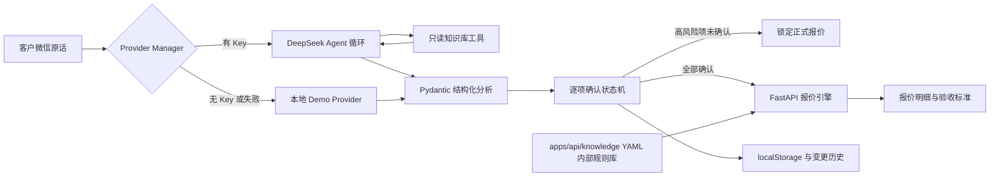

# 架构说明

## 核心边界

系统刻意把“理解语言”和“计算正式报价”分开。

1. `providers.py` 提供双模式 Provider。DeepSeek Agent 在受控循环中自主调用只读知识工具，输出由 Pydantic 校验；无 Key、网络失败或输出无效时降级到 `demo_provider.py`。
2. 浏览器维护确认状态和变更历史。只有操作员/客户选择后字段才变为 `confirmed`。
3. `pricing.py` 再次检查报价所需字段，只读取 `knowledge/pricing_rules.yaml`，逐项计算并返回价目来源。前端不能绕过后端锁定。
4. 验收标准由 `acceptance_templates.yaml` 按产品结构组合，不由模型临场编造。

## 数据流

## 重要设计决定

- MVP 无数据库、账户或复杂权限；会话仅保存在当前浏览器。
- 金额采用后端程序计算并统一保留两位小数。相同输入产生相同金额；报价版本时间戳不同。
- 规则库里的数值是模拟的“演示门店内部价目”，不代表市场行情。
- `Provider` 边界已独立；未来可加入真实模型，但必须继续输出同一 Pydantic 契约，且不能接管确认状态和报价计算。
- UI 使用 App Router、TypeScript 和本地 shadcn/ui 风格 primitives；没有运行时外部字体、图片或模型依赖。

## API

- `GET /health`：健康状态与当前 Provider。
- `POST /api/analyze`：接收 `{text}`，返回结构化明确项、歧义、缺失、问题、无依据假设和高亮证据。
- `POST /api/refine`：把自定义答案、目标字段和当前需求状态交回 Agent；信息足够时确认，否则返回更聚焦的追问。
- `GET /api/provider`：返回请求的 Provider、实际运行模式和模型，不返回任何 Key。
- `POST /api/quote`：接收确认后的施工字段；缺少必需确认字段返回 HTTP 409，不在规则库的产品或区域返回 422。

## Agent 安全边界

- Agent 工具只有知识查询和需求策略，没有任意文件、网络或代码执行能力。
- 工具循环最多 4 轮，防止无界调用。
- 初次分析若模型错误输出 `confirmed`，服务端会降级为 `explicit` 或 `suggested`。
- 模型引用的原文若不在客户输入中，会被服务端移除。
- Agent 没有读取 `pricing_rules.yaml` 的工具，也不能生成正式金额。
